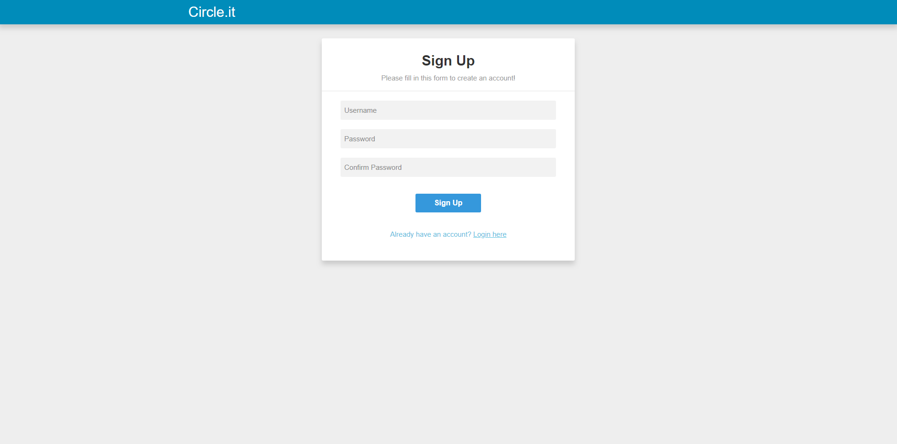
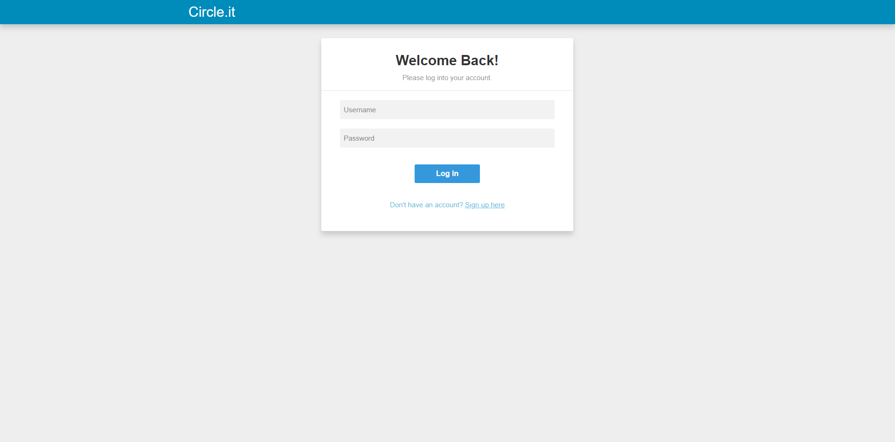
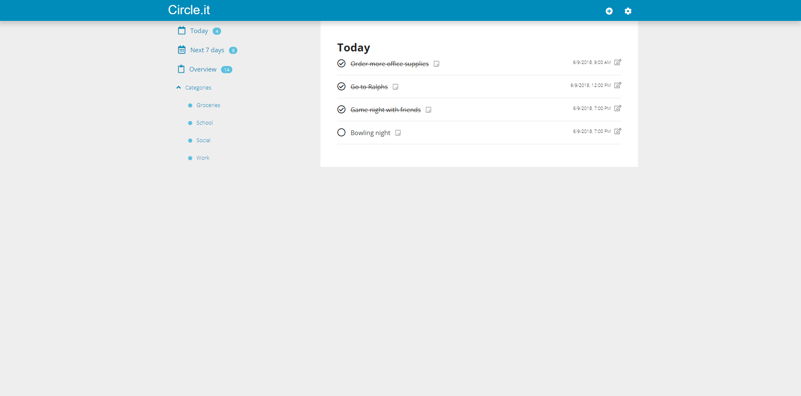
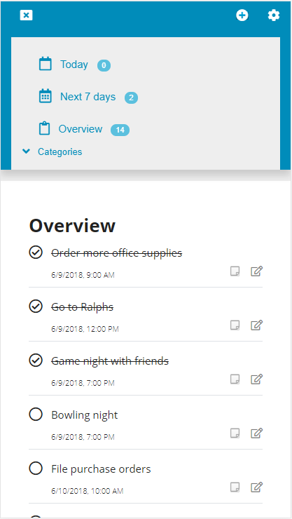

# Circle.it

A simple personal task management application design to help users manage their day to day tasks.

## Motivation

When you have so many things to do in one day, you may lose track and forget some along the way. This application will help you organize your day to day tasks so you
won't have to memorize and forget them.

## Screenshots

Sign-up Page:

Login Page:

Landing Page:

Mobile Landing Page:

## Demo

username: dummy
password: dummy123

Log in with a preexisting demo account listed above and give it a try.

## Built With

* HTML
* CSS
* JavaScript
* jQuery
* Node.js
* Mlab
* Heroku

## Features

* Add, update, and delete tasks.
* Categorized tasks.
* Filter by "Today", "Next 7 days", or specific category.
* Attach notes to individual tasks.
* Have due dates for individual tasks.
* Mark tasks as complete/incomplete.

## Future implementations

* Set priority levels.
* Reminder and alarm feature.
* Share and collaborate with other users.
* Subtasks for each tasks.

## Author

* **Anawin Vanichyanukroh** - ** - Front-End Development, Back-End Development, Testing, Styling

## Acknowledgments

* **Jay Kumar** - ** - Mentor, Consultant